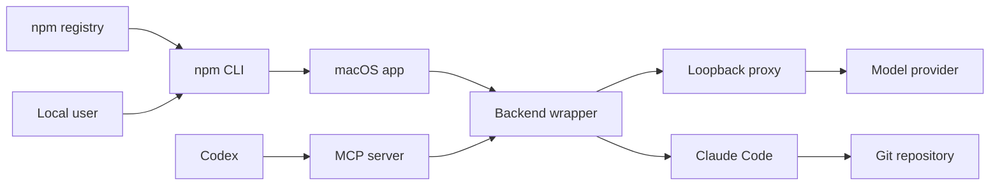

# Claude GPT Launcher threat model

## Executive summary

The highest residual risks are npm supply-chain compromise and prompt-driven
access to sensitive local files when processing an untrusted repository. The
launcher now avoids install-time scripts, pins resolved executable paths,
selects an unused localhost port, validates real repository paths, limits MCP
work, and refuses to overwrite unrelated local artifacts. It is still a
same-user developer tool rather than an OS sandbox, so untrusted repositories
should run in a disposable account or container.

## Scope and assumptions

- In scope: `npm/`, `script/`, `Sources/ClaudeGPTMCP/`,
  `Sources/ClaudeGPTLauncher/`, `Resources/`, and npm packaging metadata.
- Runtime assumption: individual Apple-silicon Mac developer account with
  Claude Code, Codex, and the proxy installed intentionally.
- Distribution assumption: public npm package; no lifecycle `postinstall`.
- Data assumption: repository content and prompts may be confidential; OAuth
  credentials stay in provider-supported storage.
- Out of scope: security of Claude Code, Codex, the proxy implementation, model
  providers, npm itself, and a fully compromised local user account.

Open questions that could change ranking:

- Enterprise or shared-Mac deployment would increase local isolation risk.
- Automated CI use would require non-interactive credential and artifact rules.
- Supporting untrusted third-party repositories would make OS sandboxing a
  release requirement rather than a recommendation.

## System model

### Primary components

- npm CLI: explicit installation, diagnostics, MCP registration, and removal
  (`npm/cli.mjs`).
- Native SwiftUI launcher: selects a Git repository and opens Terminal
  (`Sources/ClaudeGPTLauncher/`).
- Backend wrapper: starts a loopback proxy and Claude Code process
  (`script/claude-gpt`).
- MCP server: validates requests and delegates bounded plan/edit tasks
  (`Sources/ClaudeGPTMCP/`).
- Build/package tooling: builds and ad-hoc signs the local app
  (`script/build_and_run.sh`, `package.json`).

### Data flows and trust boundaries

- npm registry → npm CLI: package source and executable scripts; npm integrity
  metadata applies, but publisher-account compromise remains possible.
- User → npm CLI: explicit commands and repository-protection patterns; parsed
  as argument arrays without a shell.
- Codex → MCP server: newline-delimited JSON-RPC containing repository paths,
  prompts, models, and edit intent; schema and size controls are applied.
- MCP server → backend wrapper: validated repository root and fixed CLI flags;
  environment is reduced to a narrow allowlist.
- Backend wrapper → loopback proxy: prompts and model traffic over a randomly
  selected `127.0.0.1` port; an occupied port fails closed.
- Claude Code → repository: read or edit tools under the user's OS account;
  tool restrictions and deny patterns apply, but no OS sandbox exists.

#### Diagram

## Assets and security objectives

| Asset | Why it matters | Security objective (C/I/A) |
|---|---|---|
| Repository content | May contain proprietary source and configuration | C/I |
| OAuth credentials | Account compromise could consume subscription access | C/I |
| Local filesystem | Same-user processes can access personal developer files | C/I/A |
| MCP edit authorization | Controls whether delegated changes are permitted | I |
| npm package and app bundle | Compromise executes code under the installer user | I |
| Proxy availability | Required for model-backed sessions | A |
| Logs and MCP output | May contain code, paths, or errors | C |

## Attacker model

### Capabilities

- Publish or substitute a malicious npm package after publisher compromise.
- Commit prompt-injection content to a repository the user opens.
- Invoke the local MCP if the attacker already controls a permitted Codex/MCP
  client under the same user account.
- Race or occupy local ports and place executables earlier in a hostile `PATH`.
- Supply malformed paths, symlinks, prompts, and oversized MCP work requests.

### Non-capabilities

- No unauthenticated internet listener is exposed by this repository.
- A remote attacker cannot directly call the stdio MCP without local process
  access.
- The tool does not intentionally read or store OAuth tokens.
- The model cannot execute Bash through the MCP's declared tool set.

## Entry points and attack surfaces

| Surface | How reached | Trust boundary | Notes | Evidence |
|---|---|---|---|---|
| npm CLI arguments | Local shell or `npx` | User → CLI | Explicit write commands; JSON mode | `npm/cli.mjs` command switch |
| npm package install | npm registry | Registry → local user | No `postinstall`; package still contains executable code | `package.json` scripts and bin |
| Project picker | Native app | User → app | Resolves selected Git root | `ProjectInspector.swift` |
| MCP JSON-RPC | Codex stdio | Codex → MCP | Plan and gated edit tools | `ClaudeGPTMCPServer.swift` |
| Project path | MCP tool argument | Client → filesystem | Symlinks resolved; real root rechecked | `MCPProjectGuard.validate` |
| Prompt | MCP tool argument | Client/repository → model | Length and turn limits; prompt injection remains | `ClaudeHarnessRunner.run` |
| Proxy port | Local TCP | Wrapper → proxy | Random loopback port; occupied port rejected | `script/claude-gpt` |
| Install destinations | Local filesystem | npm CLI → user home | Ownership checks prevent name collisions | installer and uninstall functions |

## Top abuse paths

1. Attacker compromises npm publisher → publishes a trojan release → user runs
   `npx ... install` → attacker gains same-user code execution.
2. Malicious repository embeds prompt instructions → Claude reads them during
   analysis → attempts to read sensitive files outside the repo → content is
   returned through MCP. Common secret directories are denied, but the OS does
   not enforce full confinement.
3. Overbroad user request plus enabled MCP edits → model changes more files than
   intended → repository integrity is damaged before Codex review.
4. Local process occupies a chosen proxy port → launcher detects the listener
   and fails rather than sending prompts to it.
5. Hostile working environment alters `PATH` → wrapper resolves each dependency
   before entering the repository and invokes the absolute path.
6. Unrelated app/helper/MCP uses the same name → install or uninstall checks
   ownership → operation refuses or skips the unrelated artifact.
7. Client submits excessive prompt/output work → prompt, output, turn, and time
   limits terminate the request before unbounded local resource consumption.

## Threat model table

| Threat ID | Threat source | Prerequisites | Threat action | Impact | Impacted assets | Existing controls (evidence) | Gaps | Recommended mitigations | Detection ideas | Likelihood | Impact severity | Priority |
|---|---|---|---|---|---|---|---|---|---|---|---|---|
| TM-001 | npm account/package compromise | User installs a malicious release | Execute arbitrary package code | Same-user compromise | Filesystem, credentials, source | No dependencies or postinstall; `package.json` | Publisher integrity is external | Enable npm 2FA, provenance, protected release workflow, and signed Git tags | Monitor npm owner/version changes | Medium | High | High |
| TM-002 | Malicious repository content | User delegates analysis of untrusted code | Prompt injection induces out-of-repo reads | Secret or source disclosure | Filesystem, credentials | Tool allowlist and credential-directory deny rules in `ClaudeHarnessRunner.swift` | Claude Code can normally read outside cwd | Recommend container/disposable account; evaluate a real sandbox before claiming untrusted-repo safety | Audit returned paths and provider telemetry | Medium | High | High |
| TM-003 | Overbroad model action | MCP edits explicitly enabled | Modify unintended in-repo files | Repository integrity loss | Source, Git state | Install-time edit gate, call confirmation, no Bash, Codex diff validation | Confirmation is delegated to client policy | Keep edits off by default; add per-call UI approval if Codex exposes one | Log mode, root, and changed-file summary without content | Medium | Medium | Medium |
| TM-004 | Same-user local process | Can bind local TCP first | Capture proxy-bound traffic | Prompt/source disclosure | Repository content | Random loopback port and occupied-port fail-closed logic in `script/claude-gpt` | Port allocation still has a small race | Prefer authenticated Unix socket if proxy supports it | Record bind failures without prompt data | Low | High | Medium |
| TM-005 | Hostile PATH/repository | User launches from manipulated environment | Substitute git, curl, proxy, or Claude binary | Same-user execution | Filesystem, credentials | Absolute executable resolution before `cd` in `script/claude-gpt` | A hostile PATH before launch can still select a malicious binary | Document trusted installation sources; optionally pin known install locations | `doctor` reports resolved paths | Low | High | Medium |
| TM-006 | Name collision or malicious local artifact | Existing same-name app/helper/MCP | Trick install/uninstall into replacing unrelated data | Local data loss or tool hijack | Filesystem, app integrity | Bundle ID, ownership marker, and MCP-command checks | Marker is not cryptographic | Add manifest hashes for future upgrades | Report every skipped collision | Low | Medium | Low |
| TM-007 | MCP client/model output | Authorized local call | Return sensitive code or fill disk | Disclosure or local DoS | Logs, source, availability | Private temporary logs, 0600 files, default cleanup, 10 MB output, and 10-minute timeout in `CommandRunner.swift` and `script/claude-gpt` | MCP response intentionally enters Codex chat | Add optional redaction and lower configurable limits | Count failures by reason, never log prompt content | Medium | Medium | Medium |
| TM-008 | Symlink/path manipulation | Client supplies crafted path | Escape home/repository boundary | Unauthorized local reads/edits | Filesystem | Resolve symlinks and revalidate Git root in `MCPProjectGuard.swift` | Files inside an allowed repo may themselves be symlinks | Treat untrusted repositories as requiring OS isolation | Log rejected canonical root only | Low | High | Medium |

## Criticality calibration

- Critical: remote or package-level compromise that silently extracts provider
  credentials at scale; arbitrary code execution from a normal read-only call.
- High: likely disclosure of local secrets from an untrusted repository;
  malicious npm release executing as the developer.
- Medium: same-user port race, overbroad in-repo edits, bounded resource abuse,
  or path attacks requiring a crafted local repository.
- Low: safe refusal, diagnostic path disclosure to the local user, or collision
  behavior that skips rather than deletes an artifact.

## Focus paths for security review

| Path | Why it matters | Related Threat IDs |
|---|---|---|
| `npm/cli.mjs` | Owns installation, registration, and destructive removal | TM-001, TM-006 |
| `package.json` | Defines public package execution and release scripts | TM-001 |
| `script/claude-gpt` | Controls executable resolution, proxy lifecycle, and environment | TM-004, TM-005 |
| `script/install_backend.sh` | Writes an executable into the user's home | TM-006 |
| `script/build_and_run.sh` | Replaces and signs the installed app bundle | TM-001, TM-006 |
| `Sources/ClaudeGPTMCP/MCPProjectGuard.swift` | Enforces canonical repository boundaries | TM-008 |
| `Sources/ClaudeGPTMCP/ClaudeHarnessRunner.swift` | Defines tool, prompt, edit, and model policy | TM-002, TM-003 |
| `Sources/ClaudeGPTMCP/CommandRunner.swift` | Handles environment, temp output, timeout, and subprocesses | TM-005, TM-007 |
| `Sources/ClaudeGPTMCP/ClaudeGPTMCPServer.swift` | Parses client input and exposes edit capabilities | TM-003, TM-007 |
| `SECURITY.md` | Sets disclosure expectations and states the non-sandbox boundary | TM-001, TM-002 |

## Quality check

- [x] Covered npm, CLI, app, MCP, subprocess, filesystem, and loopback entry points.
- [x] Represented every discovered trust boundary in at least one threat.
- [x] Separated runtime behavior from build, test, and publication behavior.
- [x] Recorded the assumed individual-developer deployment model and open
  enterprise/untrusted-repo questions.
- [x] Distinguished implemented controls from residual risks and recommendations.
