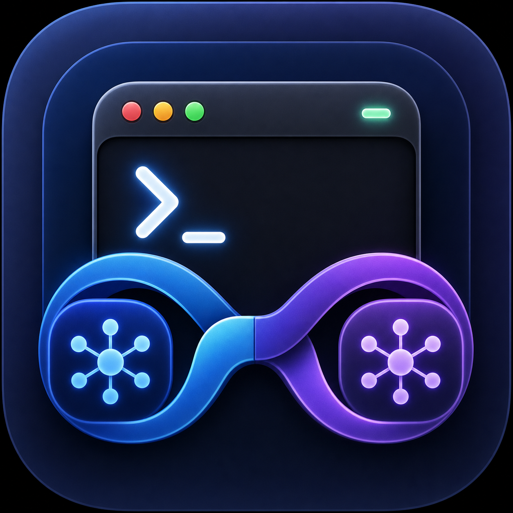

<p align="center">
  
</p>

<h1 align="center">Claude GPT Launcher</h1>

<p align="center">
  <strong>The Claude Code workflow. GPT models. One click.</strong>
</p>

<p align="center">
  
  
  
  
  <a href="https://www.npmjs.com/package/claude-gpt-launcher"></a>
  
</p>

Claude GPT Launcher is a tiny native macOS app for developers who enjoy the
Claude Code terminal experience and want to route it through GPT models exposed
by a local Codex-compatible proxy.

Pick a repository. Pick a model. Get a real Claude Code session—without copying
tokens, pasting environment variables, or leaving a proxy running forever.

> [!IMPORTANT]
> This is an independent community project. It is not affiliated with,
> endorsed by, or supported by Anthropic or OpenAI. It relies on the third-party
> [`raine/claude-code-proxy`](https://github.com/raine/claude-code-proxy)
> project and may be affected by provider policy or protocol changes.

## Why does this exist?

Claude Code has a distinctive interactive harness: project awareness, planning,
edits, tool calls, and a terminal-first workflow. Codex-backed GPT models offer
a different model family and subscription path. This project joins those two
pieces behind a friendly Mac launcher and an optional MCP bridge.

```text
Native Mac app or Codex chat
             ↓
      Claude Code harness
             ↓
  localhost compatibility proxy
             ↓
       Codex / GPT models
```

## What you get

| Surface | What it does |
|---|---|
| 🖥️ Native app | Pick any Git project and open a configured Claude Code session |
| ⌨️ `claude-gpt` | Start the same workflow from any terminal |
| 🔌 Codex MCP | Let a Codex chat consult or edit through the Claude Code harness |
| 🧭 Model picker | Switch between configured Sol, Terra, and Luna model aliases |
| 🧹 Owned cleanup | The session stops its own proxy and removes temporary state |

## Quick start

### 1. Install the prerequisites

Install Claude Code using Anthropic's package:

```zsh
npm install --global @anthropic-ai/claude-code
```

Install the proxy:

```zsh
brew install raine/claude-code-proxy/claude-code-proxy
```

Start the proxy's supported browser OAuth flow:

```zsh
claude-code-proxy codex auth login
claude-code-proxy codex auth status
```

The login result is stored by the proxy in macOS Keychain. Never paste or
commit the resulting credential.

### 2. Install Claude GPT Launcher

Install and build from npm:

```zsh
npx claude-gpt-launcher install
```

Or download the Apple-notarized ZIP from the
[latest GitHub release](https://github.com/Bennyyy28/claude-gpt-launcher/releases/latest),
verify its checksum, and move **Claude GPT.app** to Applications:

```zsh
shasum -a 256 -c Claude-GPT-Launcher-*.zip.sha256
```

### 3. Open a project

Open **Claude GPT** from `~/Applications`, drag in a Git repository, choose a
model, and select **Open Claude GPT**.

Or skip the window:

```zsh
claude-gpt "$HOME/code/my-project"
```

## Bring the harness into Codex

The installed app bundles a local stdio MCP server:

- `claude_code_plan` performs a read-only harness consultation.
- `claude_code_edit` performs repository edits without Bash or network tools.

Register it with Codex:

```zsh
claude-gpt-launcher mcp install --enable-edits
claude-gpt-launcher mcp status --json
```

Then open a new Codex chat. The MCP result returns directly to that chat—no
second terminal and no prompt copy/paste.

To protect sensitive repositories by remote substring:

```zsh
claude-gpt-launcher mcp install \
  --enable-edits \
  --protected-remotes "company/production,example/private-app"
```

Matching repositories remain denied until a caller explicitly opts in.

## Useful commands

```zsh
# Check platform, dependencies, app, backend, and MCP state
claude-gpt-launcher doctor --json

# Open the app
claude-gpt-launcher open

# Remove only the MCP registration
claude-gpt-launcher mcp remove

# Remove owned app, helper, and MCP artifacts
claude-gpt-launcher uninstall
```

## Safety model

The defaults are intentionally narrow:

- The proxy binds to a randomly selected `127.0.0.1` port.
- A port collision fails closed instead of reusing an unknown listener.
- OAuth material is never printed, extracted, or committed by this project.
- MCP edits require both installation-time enablement and call-time confirmation.
- The MCP excludes Bash and network tools.
- Repository roots and symlinks are canonicalized before delegation.
- Prompts, turns, output, and runtime are bounded.
- Installation and removal refuse to overwrite unrelated same-name artifacts.

> [!WARNING]
> Claude Code is not an OS sandbox and can normally read outside its working
> directory. The MCP adds deny rules for common credential locations, but you
> should still use a disposable account, container, or VM for untrusted code.

Read the full [security policy](SECURITY.md) and
[adversarial threat model](Claude-GPT-Launcher-threat-model.md) before enabling
MCP edits broadly.

## FAQ

<details>
<summary><strong>Does this extract my subscription token?</strong></summary>

No. Authentication is initiated through the proxy's supported OAuth screen.
This project never prints or asks you to paste the resulting token.

</details>

<details>
<summary><strong>Is this an official Anthropic or OpenAI integration?</strong></summary>

No. It is an open-source compatibility project built on another open-source
proxy. Provider policies and protocols can change, so use it with that risk in
mind.

</details>

<details>
<summary><strong>Why not just use Codex directly?</strong></summary>

You absolutely can. This project is specifically for people who prefer the
Claude Code harness or want Codex to call that harness through MCP.

</details>

<details>
<summary><strong>Does closing the session stop the proxy?</strong></summary>

Yes. Each launcher session owns a temporary proxy process and cleans it up when
Claude Code exits.

</details>

## Build from source

```zsh
./script/install_backend.sh
./script/build_and_run.sh --install
npm test
```

Requirements: Apple-silicon Mac, macOS 14+, Swift 5.9+, Node.js 20+, Claude
Code, and `claude-code-proxy`.

## Contributing

Issues, focused pull requests, documentation improvements, and security-minded
reviews are welcome. Start with [CONTRIBUTING.md](CONTRIBUTING.md). Please use
private vulnerability reporting for security issues.

## Acknowledgements

- [`raine/claude-code-proxy`](https://github.com/raine/claude-code-proxy) for
  the Anthropic-compatible local proxy.
- Claude Code and Codex for inspiring a delightfully strange bridge between two
  excellent developer workflows.

## License

MIT — see [LICENSE](LICENSE).
